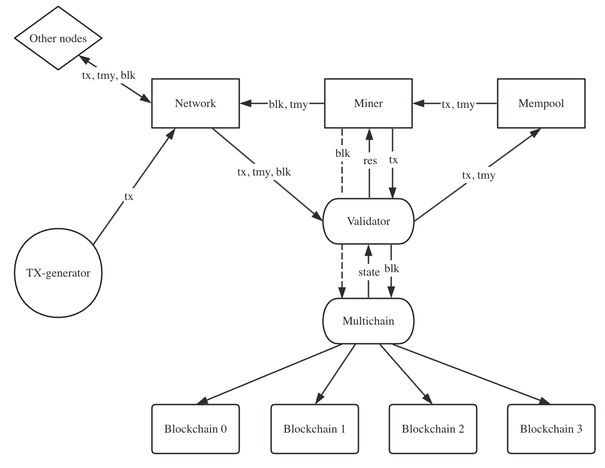

# Implementation of Manifolchain

This project aims to design and implement a high-throughput sharding Blockchain system, employing novel mining protocol and verification mechanism.

## Architecture



## Overview of Modules

- **Mempool** receives format-verified transactions and testimonies from network and matches testimonies to its corresponding transaction. Uporn requests from Miner, it returns transactions with their corresponding testimonies.
- **Miner** gets transactions and testimonies from Mempool, performs double-spending checking via Validator, and runs PoW to generate a valid block. Uporn a valid block is generated, it is passed to Multichain for insertion and it is simultaneously passed to Network for broadcasting.
- **Network** is responsible for handling communication among different nodes. It runs Gossip protocol to receive, respond, and broadcast message. There are totally three types of message to handle: transaction, testimony, and block. When receiving messages, it delegates Validator for processing.
- **Validator** inherits all the validation functionalities, including format validation and double-spending validation from transactions and blocks. It requests necessary information from Multichain for validation. There are totally four validation sources from Miner and Network:
  - Validate transactions from Network: check the format of transactions, including validity of signatures and coins. Verified transactions are pushed into the Mempool.
  - Validate blocks from Network: check both the format validity and double-spending existence based on node's view. Verified blocks are inserted into the Multichain.
  - Validate transactions from Miner: check the double-spending existence based on node's view to make sure that a new-generated block will be accepted by other nodes. (The first validation source already ensures that each transaction pop from Mempool meets format validity.) Validator returns `true` or `false` for each incoming transaction to Miner.
- **Multichain** provides interfaces to write and read blockchains across all shards.
- **Blockchain** maintains a ledger for one shard. It stores a tree for recording all historical forks, and updates states (available UTXO set) uporn each insertion. Blockchain implements sufficient interfaces for block insertion, fork pruning, and obtaining chain information.
- **TX-generator** randomly generates transactions and broadcast them to associated nodes via Network. It is not a key component of Manifoldchain system but just for experiment.

## Usage

### Simpliest Demo

Start a Manifoldchain client:

```
cargo run -- -vv --p2p 127.0.0.1:6000 --api 127.0.0.1:7000 --shardId 0 --nodeId 0 --experNumber 0 --shardNum 1 --shardSize 1 --blockSize 2048 --k 6 --domesticRatio 0.7 --eDiff 0fffffffffffffffffffffffffffffffffffffffffffffffffffffffffffffff --iDiff 07ffffffffffffffffffffffffffffffffffffffffffffffffffffffffffffff
```

parameters:

- `p2p`: the address of peer-to-peer server
- `api`: the address of API server
- `shardId`: the ID of shard where the client locats
- `nodeId`: the ID of this node
- `experNumber`: the identifier of the experiment, it determines where the log is stored
- `shardNum`: the total number of the shards
- `shardSize`: the number of clients within one shard
- `blockSize`: the number of transactions in one block
- `k`: the confirmation depth
- `domesticRatio`: the domestic transaction ratio
- `eDiff`: the mining difficulty of mining exclusive blocks
- `iDiff`: the mining difficulty of mining inclusive blocks

### Connecting Clients and Building Network

By using `-c` parameter, a new Manifoldchain client can connect to an old one. To build a fully connecting network of 4 clients, run the following 4 commands as 4 distinct processes:

Process 1:

```
cargo run -- -vv --p2p 127.0.0.1:6000 --api 127.0.0.1:7000 --shardId 0 --nodeId 0 --experNumber 0 --shardNum 2 --shardSize 2 --blockSize 2048 --k 6 --domesticRatio 0.7 --eDiff 0fffffffffffffffffffffffffffffffffffffffffffffffffffffffffffffff --iDiff 07ffffffffffffffffffffffffffffffffffffffffffffffffffffffffffffff
```

Process 2:

```
cargo run -- -vv --p2p 127.0.0.1:6001 --api 127.0.0.1:7001 -c 127.0.0.1:6000 --shardId 0 --nodeId 1 --experNumber 0 --shardNum 2 --shardSize 2 --blockSize 2048 --k 6 --domesticRatio 0.7 --eDiff 0fffffffffffffffffffffffffffffffffffffffffffffffffffffffffffffff --iDiff 07ffffffffffffffffffffffffffffffffffffffffffffffffffffffffffffff
```

Process 3:

```
cargo run -- -vv --p2p 127.0.0.1:6002 --api 127.0.0.1:7002 -c 127.0.0.1:6000 -c 127.0.0.1:6001 --shardId 1 --nodeId 2 --experNumber 0 --shardNum 2 --shardSize 2 --blockSize 2048 --k 6 --domesticRatio 0.7 --eDiff 0fffffffffffffffffffffffffffffffffffffffffffffffffffffffffffffff --iDiff 07ffffffffffffffffffffffffffffffffffffffffffffffffffffffffffffff
```

Process 4:

```
cargo run -- -vv --p2p 127.0.0.1:6003 --api 127.0.0.1:7003 -c 127.0.0.1:6000 -c 127.0.0.1:6001 -c 127.0.0.1:6002 --shardId 1 --nodeId 3 --experNumber 0 --shardNum 2 --shardSize 2 --blockSize 2048 --k 6 --domesticRatio 0.7 --eDiff 0fffffffffffffffffffffffffffffffffffffffffffffffffffffffffffffff --iDiff 07ffffffffffffffffffffffffffffffffffffffffffffffffffffffffffffff
```

### Experiment

We provide Bash scripts to automatically generate startup commands for Manifoldchain client. We present how to run a demo experiment 0 as an exsample. Under dir `./scripts/expers/exper_0/`, the configuration of experiment 0 is provided:

```
{
  "shard_num": 5,
  "shard_size": 5,
  "block_size": 2048,
  "confirmation_depth": 6,
  "mining_interval": 0,
  "tx_generation_interval": 25000000,
  "runtime": 2000,
  "iteration": 0,
  "domestic_ratio": 0.7,
  "inclusive_diff": "0000007fffffffffffffffffffffffffffffffffffffffffffffffffffffffff",
  "exclusive_diffs": [
    "0000007fffffffffffffffffffffffffffffffffffffffffffffffffffffffff",
    "000000e7ae147ae147ae147ae147ae147ae147ae147ae147ae147ae147ae1479",
    "00000188f5c28f5c28f5c28f5c28f5c28f5c28f5c28f5c28f5c28f5c28f5c28c",
    "0000025851eb851eb851eb851eb851eb851eb851eb851eb851eb851eb851eb80",
    "000002d999999999999999999999999999999999999999999999999999999993"
  ],
  "propagation_delay": 100,
  "bandwidths": [
    [5000, 5000, 5000, 5000, 5000],
    [10000, 10000, 10000, 10000, 10000],
    [20000, 20000, 20000, 20000, 20000],
    [40000, 40000, 40000, 40000, 40000],
    [60000, 60000, 60000, 60000, 60000]
  ],
  "description": "test for demo"
}
```

This .config specifies how the experiment is setup, it includes 5 shards and there are 5 clients(miners) within each shard. The mining difficulties of exclusive blocks and inclusive blocks, as well as the bandwidth for each clients are specified by the `exclusive_diffs`, `inclusive_diff`, and `bandwidths`. `mining_interval` is the waiting inverval between two mining operations. `tx_generation_interval` is the waiting interval between generating two distinct transactions.

Firstly, run `cargo build` to compile the Manifoldchain. By running `cargo test setup -- 0`, the environment for experiment 0 is ready. Under `./scripts/expers/exper_0/` run `sudo ./start.sh` to start the experiment, and it will automatically end after running a certain time specified by `runtime` in the config. If want to stop earlier, run `sudo ./end.sh` under the same dir. 

The location of an experiment is specified by the experiment number and `iteration`. When finishing, the log files are stored in `./log/exper_0/iter_0/{node_id}.txt`, while the running outputs of the program are stored in `./log/exper_0/iter_0/exec_log/{node_id}.txt`.
