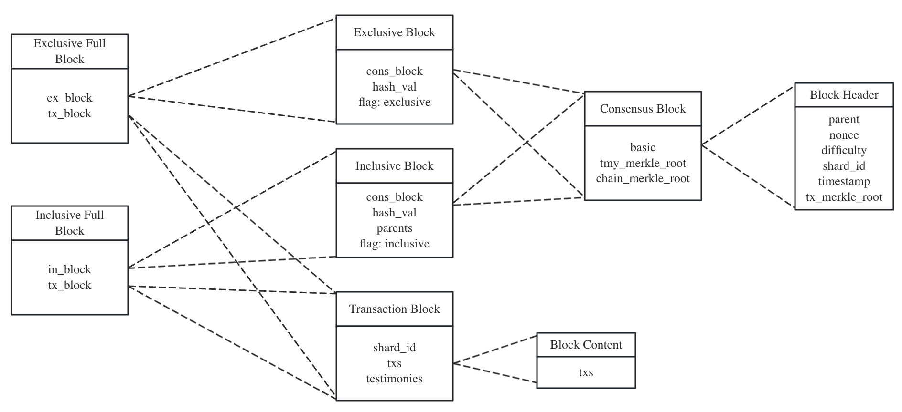

# Block Structure

`VersaBlock` is a `Enum` value which represents one of the following four block types:
* `ExclusiveBlock`
* `InclusiveBlock`
* `ExclusiveFullBlock`
* `InclusiveFullBlock`

Furthermore, in the blockchain within its own shard, there are only three types of blocks exit:
* `InclusiveBlock`
* `ExclusiveFullBlock`
* `InclusiveFullBlock`

In other hand, in the blockchain within other shard, there are only two types of blocks exit:

* `ExclusiveBlock`
* `InclusiveBlock`

