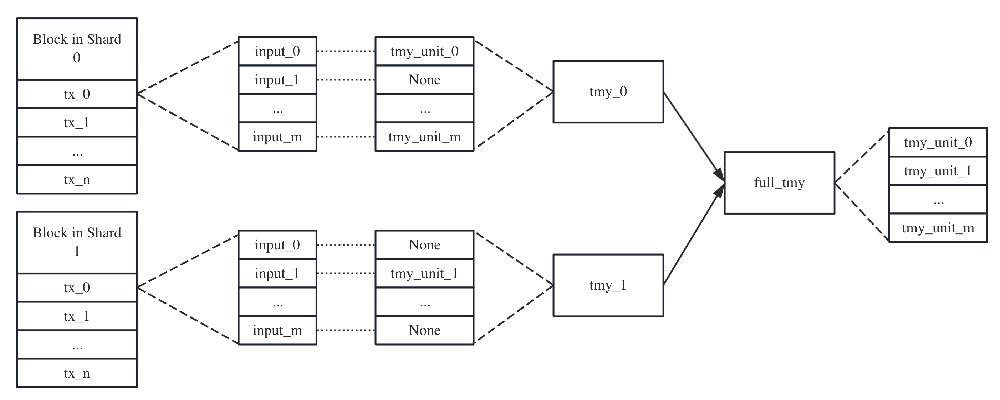
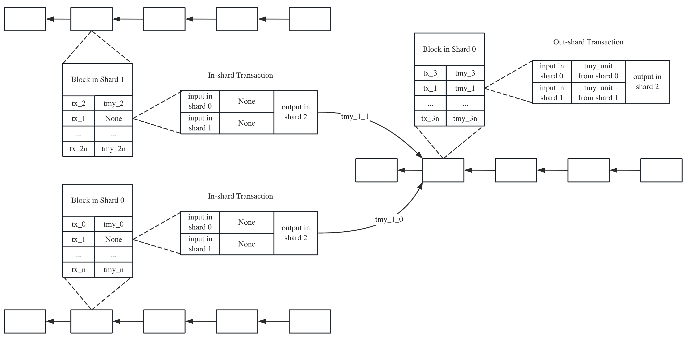

# Testimony

## Structure

`TestimonyUnit`
* `input_hash`: The hash value of input
* `originate_block_hash`: The hash value of the originate block
* `tx_merkle_proof`: The transaction merkle proof of the souce transaction
* `tx_index`: The index of the source transaction in the block

`Testimony`
* `tx_hash`: The hash value of the corresponding transaction
* `units`: Each unit corresponds to an input of the transaction

## Insight

Testimony, or Attestable Atomicity, is the key contribution of Manifoldchain, and it is also the most difficult to understand. Following the following example and some questions may faciliate the understanding.

### What transactions have testimonies?

The transactions are categorized into three types:

* Domestic transactions do not have testimonies
* Cross-shard transaction: a cross-tx is duplicated multiple times, each input-shard tx for each input, and each output-shard tx for each output.
    * Input-shard txs do not have testimonies, they just announce that the UTXOs are locked.
    * Output-shard txs have testimonies, they create new UTXOs in the destination shards

Output-shard txs are allways packaged after input-shard txs.

### When testimonies are generated?

When input-shard transactions are packaged into blocks, the miner generate a testimony unit for each input belonging to its shard, and collect all testimony units to generate a testimony. Noticed that this testimony only contains units corresponding to the inputs within the miner's shard. We currently call this testimony partial testimony. Each partial testimony will be sent to shards where the outputs locate. 

### When will testimonies packaged into blocks?

Miners in the destination shards will receive multiple partial testimonies for one out-shard tx, because it inputs may come from various shards. After receiving all partial testimonies of a tx, miners combine them into a full testimony, and package it along with the out-shard tx into a block.
    